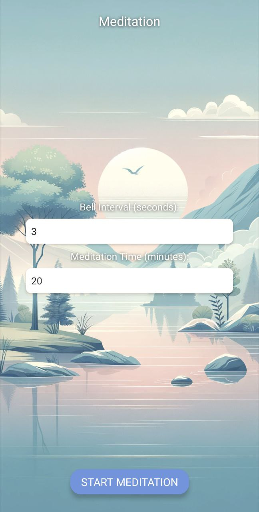

# Meditation Bell App

A simple expo application that plays a meditation bell sound every x minutes.

## Features

- Run a customizable timer to limit the meditation session.
- Play a meditation bell sound every x minutes as a reminder to stay focused.
- Plays three bells when the timer is up.
- Prevents the device from going to sleep while the timer is running.

## Installing and running

Please refer to the [Expo Go Documentation](https://docs.expo.dev/get-started/expo-go/) for installing and running the app locally.